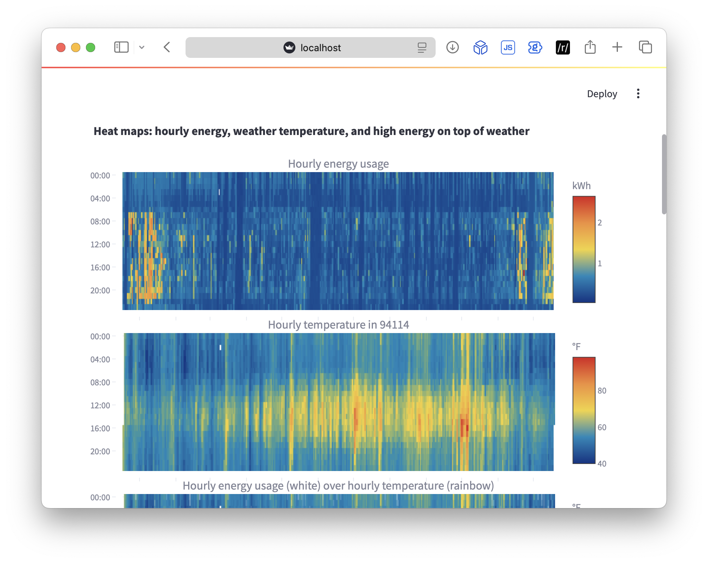

# PG&E *Download My Data* Plots

This repo contains a [Streamlit](https://streamlit.io/) dashboard that generates **interactive** plots of:
    
1. Electric energy usage from [PG&E *Download My Data*](https://www.pge.com/en/save-energy-and-money/energy-usage-and-tips/understand-my-usage.html#accordion-faec0a92be-item-687e81ab07)
2. Hourly weather data at the zip code of the PG&E account via [Meteostat](https://dev.meteostat.net/python/)

Example PG&E data is included as a demo. Here's a preview:

There is a secondary goal of this repo: to experiment with distributing a Python tool using [Astral uv](https://docs.astral.sh/uv/), a Python package and project manager

A little bit more about the motivation for this repo are on my blog: https://www.nickgregorich.com/posts/more-uv-and-pge-plots/

## Installation

1. Install [Astral uv](https://docs.astral.sh/uv/getting-started/installation/)
    1. Recently I've been using [mise-en-place](https://mise.jdx.dev/) (not required)
        1. In this case you can install `uv` with `mise use --global uv`
2. Clone this repo

## Usage

1. Change into the repo directory
2. Start the Streamlit dashboard: `uv run streamlit run pge_plots.py -- --level INFO`
   1. **Note:** this starts the dashboard with logger showing `INFO` level messages. Run without the `--level` argument for the less chatty `WARNING` logger level
   2. Alternatively, using mise: `mise trust` then
      1. `mise run plots_info` for `INFO` level logger
      2. `mise run plots` for `WARNING` level logger
3. This will open a web browser to: [http://localhost:8501](http://localhost:8501)
4. The dashboard will load with example energy usage 
   1. Instructions on how to use your own PG&E data is at the top of the dashboard 
5. Explanation for each plot included in the *About* expanders

**Note:** to stop the dashboard, kill the Streamlit process with `control-c` or similar

## What is uv doing here?

Hopefully that felt like a quick and easy way to run a Python script, thanks to `uv`! But what exactly is going on here?

1. The Python version required by this project is read from `pyproject.toml` and installed (if required)
   1. A virtual environment is created in the project directory referencing the required version in `.venv`
   2. In this case, we are using Python 3.13
   3. This was automatically set when the project was created with `uv init`
2. The dependencies required by the project are also read from `pyproject.toml` and installed
   1. Dependencies are added to the project using `uv add <package>`
   2. Dependencies are removed from the project using `uv remove <package>`

The dream is that the headaches and heartburn associated with distributing a Python project will be a thing of the past with `uv` 💫

## Contributing

This project was intended as a `uv` demo where you can plot your PG&E energy usage, so I am not expecting contributions – but please feel free to file an Issue or PR

However, I'd love to see if you find anything interesting in your PG&E plots! Please create a Discussion or email the address on my blog (linked above)

## License

[MIT](LICENSE.md)